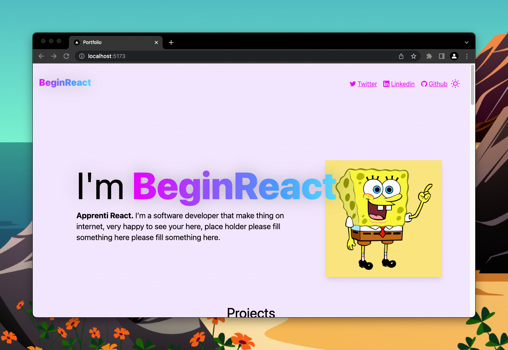
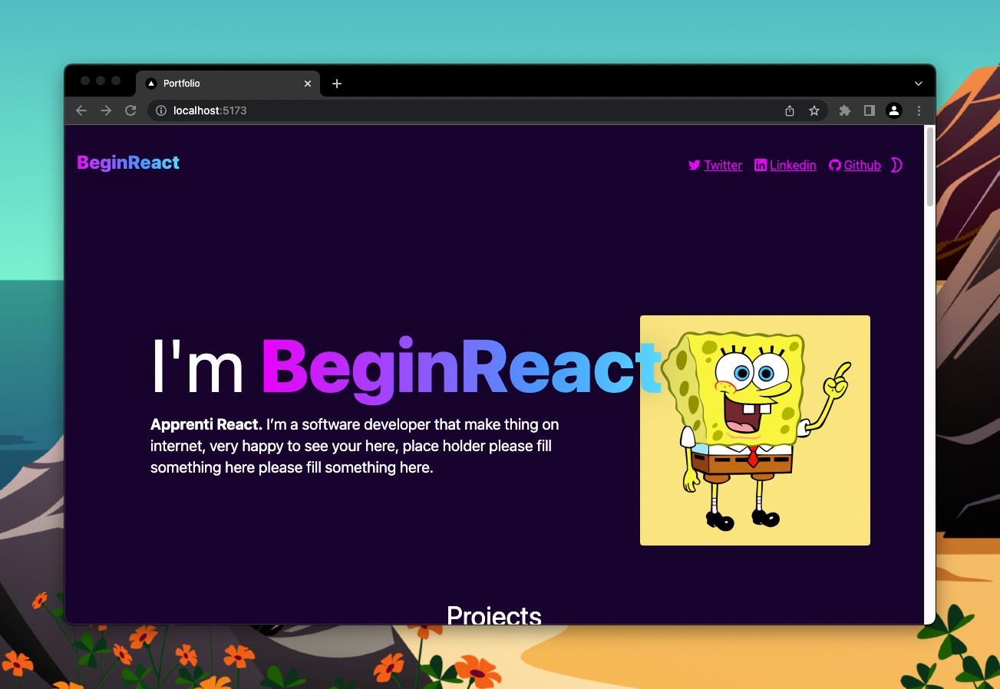

# Dark Mode

### Résultat

|               Light mode               |              Dark mode               |
| :------------------------------------: | :----------------------------------: |
|  |  |

Et le switch de thème ressemble à ça :

### Consignes

Tout site web qui se respecte a un dark mode.

J'ai simplifié la tâche pour toi.

Dans le fichier `/pages/_app.js` tu as une div avec l'id "app". Elle possède
la classe "dark". Si tu lui enlèves cette classe : boom ! Tout devient light.

Donc c'est dans ce fichier qu'on va gérer le dark-mode.

Mais comment ?

Tu vas devoir créer un context dans `src/context/ThemeProvider.jsx`. Celui-ci
aura un state `theme` qui devra pouvoir être récupéré partout dans l'app et aussi
"toggle" partout dans l'application.

Il y a un button, qui est déjà fait, pour changer le Theme qui se nomme :
`ToggleDarkThemeButton.jsx`.

Quelques conditions :

- Si l'utilisateur change le theme, il doit être enregistré dans le localStorage.
- Par défaut, c'est le thème de l'ordinateur qui doit être utilisé, utilise [prefers color scheme](https://developer.mozilla.org/fr/docs/Web/CSS/@media/prefers-color-scheme)
- Si le thème par défaut de l'utilisateur change, il faut que le thème de l'application aussi
  sauf si l'utilisateur a défini le thème à la main, dans ce cas aucune modification n'est faite.

Pas clair ? Regarde la vidéo Intro et test la démo.

Hésite pas à aller check le site terminé : https://beginreact-workshop.vercel.app

⚠️ Avec NextJS aucun appel de localStorage ne doit être fait autre part quand
dans un useEffect !

### Tips

3 tips disponibles dans [TIPS.md](./TIPS.md)
