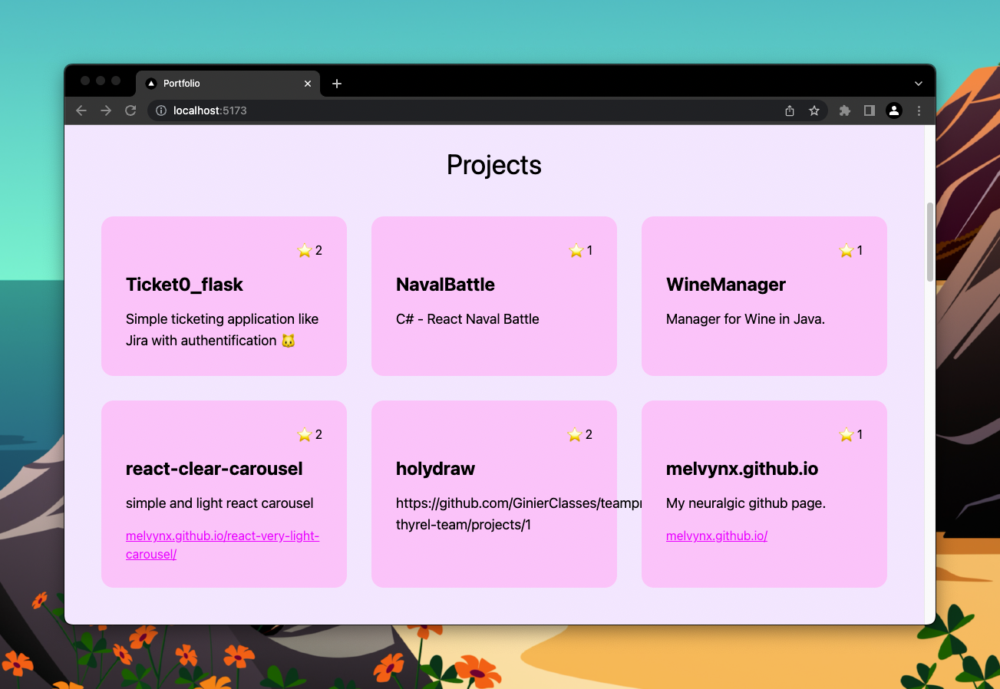

# GitHub Repository

### Résultat



### Consignes

Maintenant on va récupérer tous tes GitHub repository que tu as mis en Pinned et
les afficher sur ton portfolio.

<details>
<summary><b>Si tu n'as pas de Github Repository Pined</b></summary>

Tu n'as qu'à en créer un nouveau
et push le projet que tu vois ici sur GitHub.

Pour ça tu peux aller dans [repo.new](https://repo.new) et crée un repository.

Prend l'URL git qui est associé à ton repository puis fais ses commandes dans ton terminal bash :

```bash
git remote remove origin
git remote add origin <url que tu as copié de ton repository>
git push --set-upstream origin master
```

Et maintenant tu peux te rendre ton profile Github, tu verras
une section vide "Pinned Repositories" avec un bouton "Customize your pin"
ou tu pourras rajouter ton repository.

</details>

Le but est de récupérer la liste de tes repository en utilisation [fetch](https://developer.mozilla.org/en-US/docs/Web/API/Fetch_API),
tu n'as pas besoin de te soucier de l'url car j'ai créé une fonction pour toi
dans le fichier `src/lib/api-url.js`.

Tu auras besoin de gérer un states pour fetch les repository.

J'ai envie que tu affiches un Loader le temps que ça charge, tu trouveras
un composant Loader dans le dossier `src/components/Loader`.

Si il y a une erreur, tu dois aussi l'afficher. (erreur = si on le fetch throw une erreur ou si on reçois une 400+)

Le fichier de travail est dans `ProjectSection.jsx`.

### Petit exercise : refactor

Utilise qu'un seul state pour gérer les données et le state.

Il te faut utiliser `useReducer` qui a ses états :

- `idle`: avant le premier fetch
- `pending`: pendant le fetch
- `rejected`: en cas d'erreur (ajouter une field erreur)
- `resolved`: en cas de succès (ajouter une field data)

Si tu as galère, regarde le TIPS 1 de cette exercise.

### Petit exercise : sépare le code

Crée un hooks custom qui permet de fetch des données. Il prend en paramètre
`url` et `config` pour faire comme un fetch, mais il gère toutes les données
ainsi que les erreurs.

Il retourne une fonction qui permet de refresh les données.

Le fichier pour ajouter ton hooks existe déjà dans `src/hooks/useFetch.js`

(TIPS 2)

### Bonus : Gérer le unmount

Quand ton composant est unmount, si ton fetch en `resolved` tu vas avoir
une erreur React.

Pour fixer ça il va falloir que tu utilises un hooks pour voir si ton composant
est unmount, est dans ce cas ne pas set le state.

(Essai de faire sans) [Tips 💡](https://usehooks-ts.com/react-hook/use-is-mounted)

Hésite pas à aller check le site terminer : https://beginreact-workshop.vercel.app

(TIPS 3)

### Tips

3 tips disponible dans [TIPS.md](./TIPS.md)
