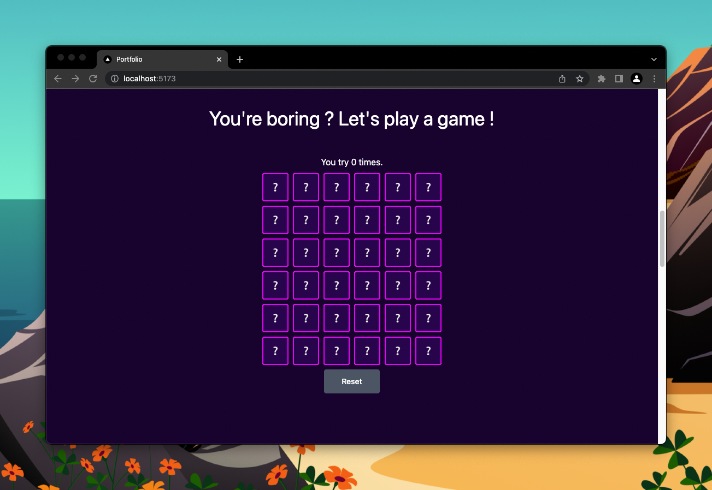

# Memory Game

## Résultat

## Instruction

L'exercice le plus compliqué de notre projet.

Le but est de recréer le memory, comme tu peux le voir sur [le site final](https://beginreact-workshop.vercel.app).

J'ai envie de te laisser seul réfléchir à cette exercise. Pour t'aider
il y a 3 tips, **que tu peux ou non regarder**, essaie sans et si besoin
ouvre les tips.

Je t'ai déjà préparé toute l'interface avec le Board et les Card.
Mais je n'ai fait aucune logique.

Mais voici les règles à respecter :

- Tu dois utiliser un Context
- On doit pouvoir réinitialiser le jeu
- Le nombre d'essais est compté
- Le memory doit être créé en utilisant la méthode `getInitialMemory` de `memory.js`

Si tu galères, regarde la vidéo solution jusqu'à être débloqué puis
reprends l'exercise.

💰 Petit bonus : L'émoji ❔ doit changer en ❓ pour le light thème.

### Marche à suivre (pour t'aider)

- Crée un context provider + useContext de celui-ci
- Avoir un state "cards" dans le context
- Avoir un state "tryCount" dans le context
- Avoir une fonction qui est appelé lors de l'update de cards
- Faire en sorte que lorsque qu'il y a deux cartes retournée, on vérifie si c'est des paires quelques secondes plus tard
- Si c'est des paires on change leur states en find sinon en hide
- Quand tout les cartes sont retourné, une constante `isWin` est définit dans le context (j'ai crée la fonction `isMemoryFinished` dans `memory.js`)

## Trop simple ?

Recommence en supprimant tout le dossier memory.
