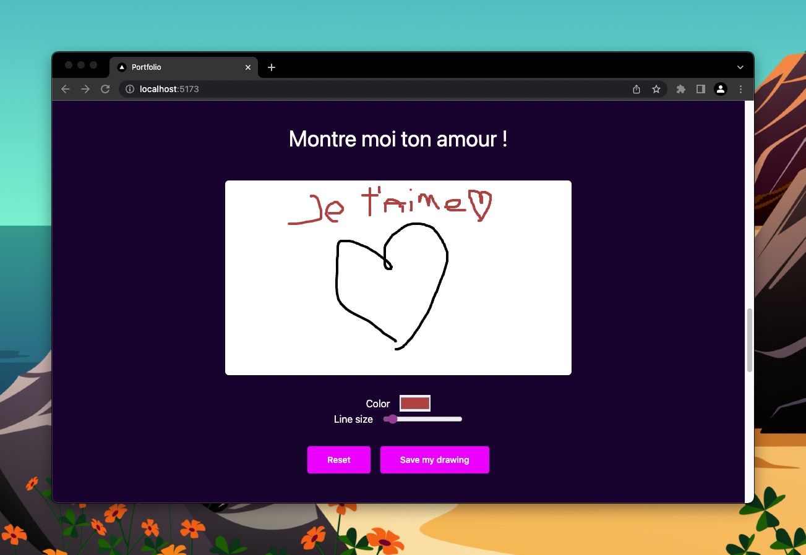

# Draw

## Résultat



## Instruction

Cette exercise est très intéressant.

On vas ajouter un petit canvas pour que les utilisateurs puissent dessiner sur notre portfolio.

Pour ça on vas utiliser beaucoup de `ref`.

Tu peux aller sur le site [final](https://beginreact-workshop.vercel.app) pour voir le résultat.

A la fin de cette exercise on pourra changer la
couleur du trait ainsi que l'épaisseur.

### Faire un dessin simple

Le but est déjà de faire fonctionner le canvas.

Pour ça tu peux aller dans le fichier `DrawCanvas`.
J'ai déjà crée la ref du canvas dans le parent (oui on peut passer des ref d'un parent à un enfant), j'ai aussi crée 2 autres ref :

- `isDrawing` : pour savoir si on est en train de dessiner ou non
- `lastCoordinate` : permet de stoker la dernière coordonnée du curseur. Car on vas toujours faire un trait entre la dernière et la nouvelle coordonnée, puis remplacer la dernière par la nouvelle.

Il y a 3 fonction :

- `startDrawing` : qui va mettre `isDrawing` à `true` et mettre à jour `lastCoordinate`

- `stopDrawing` : qui va mettre `isDrawing` à `false`

- `draw` : qui va dessiner un trait entre la dernière coordonnée et la nouvelle. Pour ça il faut utiliser `getContext` sur le canvas, puis `beginPath`, `moveTo`, `lineTo` et finalement `stroke()`. Enfin il faut oublier pas de mettre à jour `lastCoordinate`.

Pour récupérer les coordonée du cursuer par rapport au canvas tu peux utiliser :

```js
const coordinate = getCoordinates(event, canvas.current);
```

Une fonction spécialement créer pour ça.

Il faut écouter un autre event, c'est `mouseup` sur l'élément window.

Tu as déjà vue comment ajouter un listener sur window, oublie pas de le retirer.

Lorsque cette event est appeler il faut appeler `stopDrawing`.

Le dernier truc à faire c'est de définir la size et le couleur de notre trait dans le composant draw.

Effectivement pour préparer le prochaine exercise, il faut ajouter ses informations dans le parent.

Dans le useEffect récupérer le context 2d et ajoute y
un strokeStyle et un lineWidth. avec les constantes
définit dans ce fichier !

(TIPS 1 et 2)

### Gestion des couleurs et de la taille

J'ai crée un composant "DrawControl" pour éviter des
rerender on vas juste lui passer une valuer par défaut et un callback pour chaque input.

Quand ses callback seront appelé on vas modifié le
context du canvas et surtout leur couleur et leur taille.

Si ses explications sont pas claire, c'est normal.

Test, cherche et re-test.

Il n'y a pas qu'une seul solution et je ne veux pas t'imposer la mienne.

(TIPS 3)

### Reset et save button

J'ai ajouter un bouton reset et save.

Dans le reset il faut remettre le canvas entièrement blanc. (google est ton ami)

Et le "save my drawing" vas télécharger le canvas en tant qu'image. (google est ton ami, ou les tips)

(TIPS 4)
